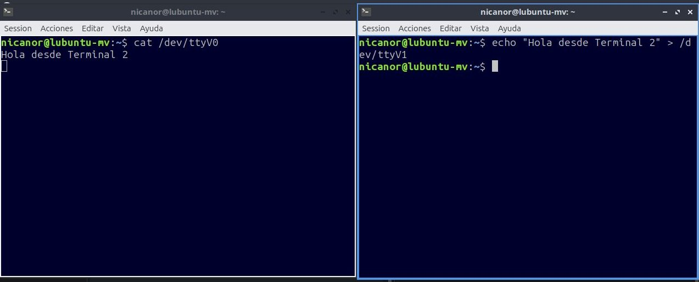
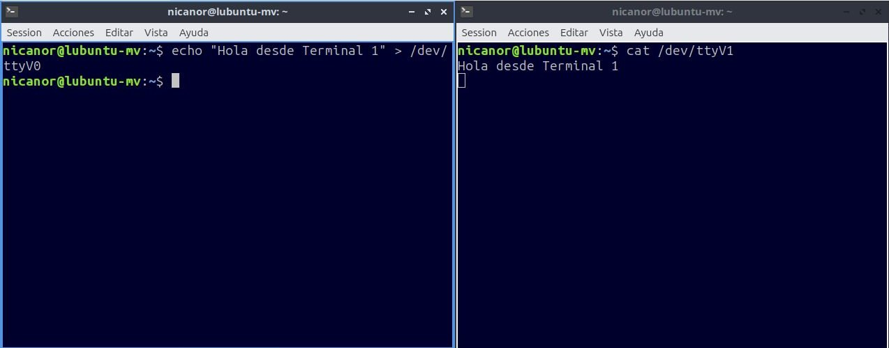
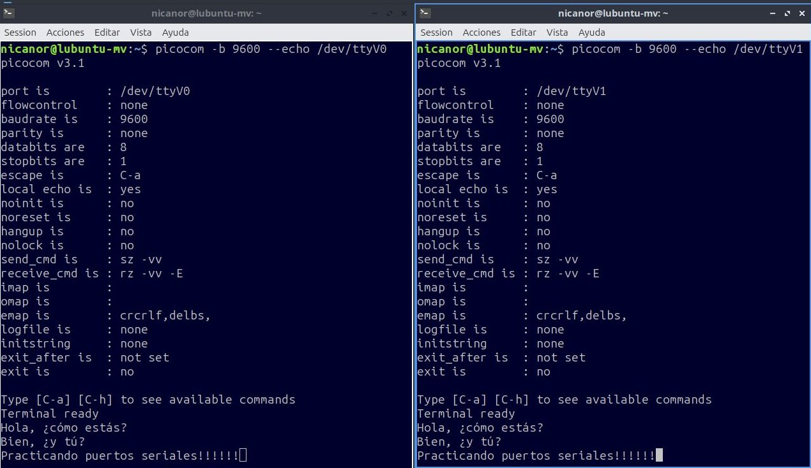
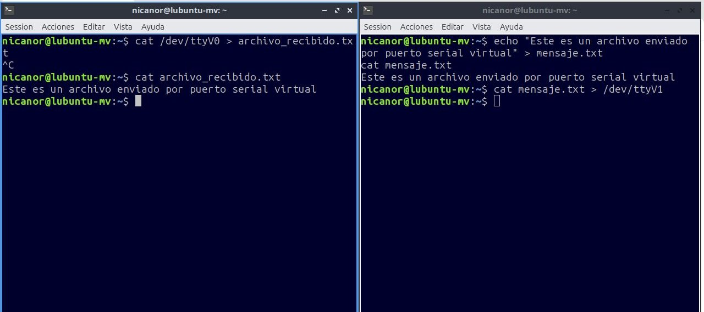

# Tarea 1: Redes - Puertos Seriales Virtuales

## Integrantes
- Yalo Palomino Nicanor
- Damián Navarro Salvador

## Fecha
28 de agosto de 2026

---

## 1. Introducción

Los puertos seriales (RS-232) son interfaces de comunicación utilizadas tradicionalmente para conectar dispositivos como módems, ratones y equipos industriales. En la actualidad, muchas computadoras ya no incluyen puertos seriales físicos, por lo que se utilizan **puertos seriales virtuales** para emular este tipo de comunicación.

En esta práctica se implementan dos puertos seriales virtuales en un sistema Linux, permitiendo la comunicación bidireccional entre dos terminales. Esto simula una conexión punto a punto similar a la que existiría entre dos dispositivos conectados por cable serial.

**Objetivos:**
- Instalar herramientas para emulación de puertos seriales
- Crear puertos seriales virtuales con `socat`
- Establecer comunicación bidireccional entre dos terminales
- Enviar archivos a través de la conexión serial

---

## 2. Instalación de Herramientas

### 2.1 Actualización del sistema

Primero se actualiza la lista de paquetes del sistema:

```bash
sudo apt update
```
### 2.2 Instalación de `socat`

`socat` (SOcket CAT) es una herramienta que permite establecer conexiones entre diferentes tipos de flujos de datos. Se instala con:

```bash
sudo apt install socat -y
```
### 2.3 Instalación del emulador de terminal
Inicialmente se intentó instalar `minicom`, pero se presentaron problemas de compatibilidad:

```bash
sudo apt install minicom -y   # No funcionó correctamente
```
Como alternativa, se instaló `picocom`, un emulador de terminal serial ligero y fácil de usar:

```bash
sudo apt install picocom -y
```
Comando completo ejecutado:
```bash
sudo apt update && sudo apt install socat picocom -y
```

---
## 3. Creación de Puertos Seriales Virtuales

### 3.1 Comando `socat` 
Para crear dos puertos seriales virtuales interconectados, se ejecuta:

```bash
sudo socat -d -d pty,raw,echo=0,link=/dev/ttyV0 pty,raw,echo=0,link=/dev/ttyV1
```
**Explicación del comando:**

|**Parámetro**|**Descripción**|
|:------------|:--------------|
| `-d -d`	|	Nivel de depuración (muestra información detallada) |
| `pty`	|	Crea un pseudo-terminal (puerto serial virtual) |
| `raw`	|	Modo raw (sin procesamiento de caracteres) |
| `echo=0`	|	Desactiva el eco local |
| `link=/dev/ttyV0`	|	Crea un enlace simbólico en la ruta indicada |


### 3.2 Salida del comando
```bash
2026/08/28 11:19:29 socat[3826] N PTY is /dev/pts/2
2026/08/28 11:19:29 socat[3826] N PTY is /dev/pts/3
2026/08/28 11:19:29 socat[3826] N starting data transfer loop with FDs [5,5] and [7,7]

```

**Interpretación:**

* El sistema asignó los pseudo-terminales `/dev/pts/2` y `/dev/pts/3`

* Se crearon los enlaces simbólicos `/dev/ttyV0` → `/dev/pts/2` y `/dev/ttyV1` → `/dev/pts/3`

* El bucle de transferencia de datos se inició correctamente
### 3.3 Verificación de los puertos creados

```bash
ls -la /dev/ttyV*
```
**Salida del comando**
```bash
lrwxrwxrwx 1 root root 10 Aug 28 11:19 /dev/ttyV0 -> /dev/pts/2
lrwxrwxrwx 1 root root 10 Aug 28 11:19 /dev/ttyV1 -> /dev/pts/3
```

### 3.4 Asignación de permisos
Para que los usuarios no privilegiados puedan usar los puertos:

```bash
sudo chmod 666 /dev/ttyV0 /dev/ttyV1
```

Verificación de permisos reales:

```bash
ls -la /dev/pts/2 /dev/pts/3
```


```bash
crw-rw-rw- 1 root tty 136, 2 Aug 28 11:19 /dev/pts/2
crw-rw-rw- 1 root tty 136, 3 Aug 28 11:19 /dev/pts/3

```

## 4. Comunicación Básica entre Terminales

### 4.1 Apertura de terminales

Se abren dos terminales (puede ser con `Ctrl+Alt+T` o desde el menú contextual del escritorio).

### 4.2 Verificación de comunicación con `cat` y `echo`

**Terminal 1 (Receptor):**
```bash
cat /dev/ttyV0
```
**Terminal 2 (Emisor):**

```bash
echo "Hola desde Terminal 2" > /dev/ttyV1
```
**Resultado**: El mensaje aparece en la Terminal 1, confirmando la comunicación.




**Prueba en sentido inverso:**

**Terminal 1 (Emisor):**
```bash
echo "Hola desde Terminal 1" > /dev/ttyV0
```
**Terminal 2 (Receptor):**

```bash
cat /dev/ttyV1
```
**Resultado**: El mensaje aparece en la Terminal 2.



### 4.3 Comunicación con picocom

`picocom` es un emulador de terminal que permite una comunicación más interactiva.

**Terminal 1:**
```bash
picocom -b 9600 --echo /dev/ttyV0
```
**Terminal 2:**
```bash
picocom -b 9600 --echo /dev/ttyV1
```
**Explicación de opciones:**

* `-b 9600`: Velocidad de transmisión (baudrate) de 9600 bps

* `--echo`: Muestra localmente lo que se escribe (eco local)

### 4.4 Conversación entre terminales

1. Una vez abiertos ambos picocom:

2. En Terminal 1, escribir un mensaje y presionar Enter

3. El mensaje aparece en Terminal 2

En Terminal 2, responder y el mensaje aparece en Terminal 1

**Ejemplo de conversación:**

Para salir de picocom: `Ctrl+A` → `Ctrl+X`



##  5. Envío de Archivos por Puerto Serial

Una funcionalidad importante de los puertos seriales es la transferencia de archivos.

### 5.1 Creación de un archivo de prueba

En la **Terminal 2 (emisor):**
```bash
echo "Este es un archivo enviado por puerto serial virtual" > mensaje.txt
cat mensaje.txt
```

### 5.2 Recepción del archivo

**Terminal 1 (Receptor):**

```bash
cat /dev/ttyV0 > archivo_recibido.txt
```
**Terminal 2 (Emisor):**

```bash
cat mensaje.txt > /dev/ttyV1
```

### 5.3 Verificación del archivo recibido

En la Terminal 1, presionar `Ctrl+C` para detener la recepción y verificar:

```bash
cat archivo_recibido.txt
```
**Salida**

```bash
Este es un archivo enviado por puerto serial virtual
```


### 5.4 Envío de archivo más grande

Para probar con un archivo más extenso:

```bash
# Crear archivo con 20 líneas
for i in {1..20}; do echo "Línea $i del archivo de prueba" >> archivo_largo.txt; done

# Enviar (Terminal 2)
cat archivo_largo.txt > /dev/ttyV1

# Recibir (Terminal 1)
cat /dev/ttyV0 > archivo_recibido_largo.txt
```

Captura

## 6. Resumen de Comandos Útiles

|	**Comando**	|	**Descripción**	|
|:--------------|:--------------------|
| `sudo socat -d -d pty,raw,echo=0,link=/dev/ttyV0 pty,raw,echo=0,link=/dev/ttyV1`| Crear puertos virtuales	|
|`sudo chmod 666 /dev/ttyV0 /dev/ttyV1`|Dar permisos de lectura/escritura|
| `picocom -b 9600 --echo /dev/ttyV0`| Abrir puerto con picocom |
|`cat /dev/ttyV0`| Leer del puerto |
| `echo "mensaje" > /dev/ttyV1` | Escribir al puerto |
| `Ctrl+A → Ctrl+X` | Salir de picocom|

## 7. Conclusiones

La práctica permitió comprender el funcionamiento de los puertos seriales virtuales en Linux, demostrando que:

1. `socat` es una herramienta poderosa para crear puertos virtuales interconectados, similar a un "cable serial virtual".

2. `picocom` resultó ser una alternativa efectiva a `minicom`, más ligera y con opciones útiles como el eco local.
3. La comunicación bidireccional funciona correctamente, permitiendo:
	* Conversación en tiempo real entre dos terminales

	* Transferencia de archivos de texto

	* Cambio de velocidades de transmisión
4. Los puertos seriales virtuales son útiles para:

	* Desarrollo y depuración de aplicaciones embebidas

	* Simulación de comunicación entre dispositivos

	* Prácticas de redes y telecomunicaciones
5. La flexibilidad de Linux permite crear estos entornos sin necesidad de hardware adicional, facilitando el aprendizaje y la experimentación.

## Anexo

| **Problema**	|**Solución** |
|:-------|:--------|
|Permission denied	| Ejecutar `sudo chmod 666 /dev/ttyV*`|
| No se ve lo que se escribe	| Usar `--echo` en picocom |
| `minicom` no funciona	| Usar `picocom` como alternativa |
| Los puertos no existen	 | Verificar que `socat` esté corriendo |
|Socat se detiene	| Mantener la terminal de socat abierta |