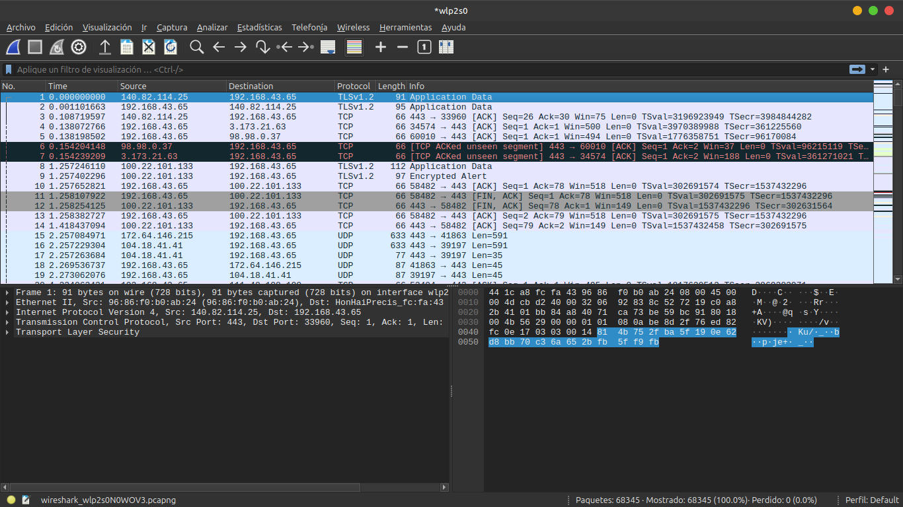
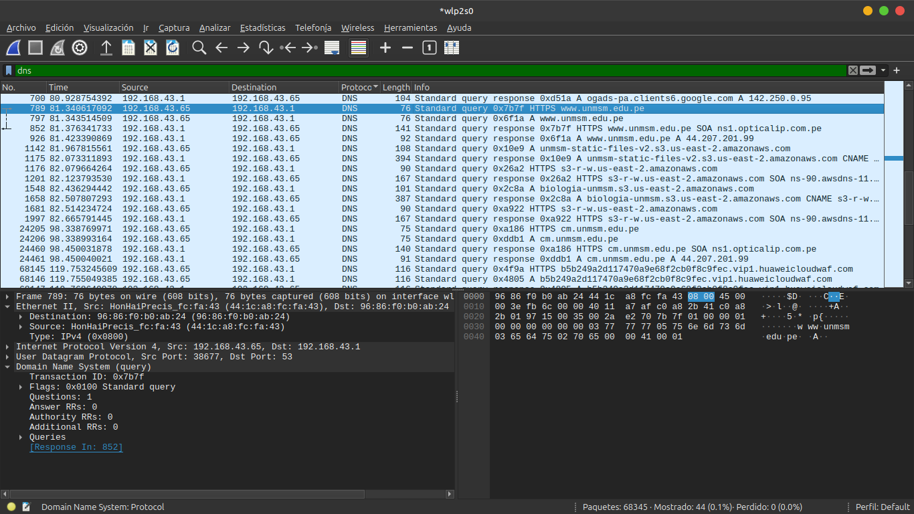
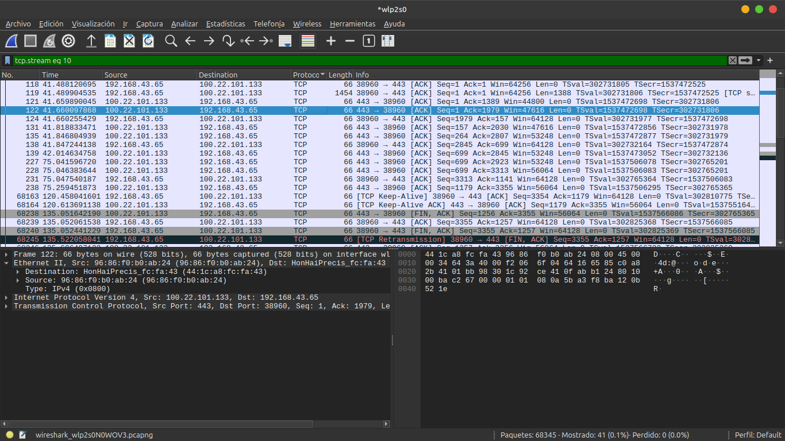

# UNIVERSIDAD NACIONAL MAYOR DE SAN MARCOS
**(Universidad del Perú, DECANA DE AMÉRICA)**  
### FACULTAD DE CIENCIAS MATEMÁTICAS  
**ESCUELA PROFESIONAL DE COMPUTACIÓN CIENTÍFICA**

* **Asignatura:** Redes y Comunicación de Datos  
* **Tarea N.° 2:** Análisis Funcional de Wireshark  
* **Docente:** Mg. Jaime Rubén Pariona Quispe  
* **Integrantes:** 
  * Huayta Huillcahuare, Luis Enrique  
  * Salvador Damián, Navarro  
  * Yalo Palomino, Nicanor    

---

## 1. ¿Qué es Wireshark y para qué sirve?

Wireshark es un analizador de protocolos de red. Funcionalmente, permite **capturar, visualizar, filtrar y examinar** los paquetes que viajan por una interfaz de red, ya sea Wi-Fi o Ethernet.

Su utilidad principal es responder preguntas como:

- ¿Qué computadoras o servidores están comunicándose?
- ¿Qué protocolos se están usando: DNS, HTTP, TCP, TLS, ARP?
- ¿Qué IP y puertos intervienen?
- ¿La información viaja cifrada o en texto plano?
- ¿Hay errores, retransmisiones o demoras?

Wireshark no bloquea tráfico, no reemplaza un firewall y no modifica paquetes. Su función es **observar y analizar** lo que ocurre en la red.

---

## 2. Funcionamiento operativo básico

Para usar Wireshark se sigue este flujo:

1. **Seleccionar una interfaz de red**: Wi-Fi, Ethernet, localhost, etc.
2. **Iniciar la captura**: Wireshark empieza a leer paquetes.
3. **Generar tráfico**: abrir una página web, hacer una consulta DNS, usar una app.
4. **Detener la captura**: se conserva la lista de paquetes.
5. **Aplicar filtros**: para quedarse solo con lo importante.
6. **Inspeccionar un paquete**: revisar sus capas, IP, puertos, bytes y contenido.

### Modo promiscuo

Por defecto, una tarjeta de red solo procesa los paquetes dirigidos a ella. Wireshark puede activar el **modo promiscuo**, que le pide al hardware capturar todo el tráfico que pasa por la interfaz. Esto permite analizar más información, siempre que el usuario tenga permisos y la red lo permita.

---

## 3. Interfaz principal: los tres paneles clave

La ventana de Wireshark se divide en tres zonas principales.

### 3.1 Panel de lista de paquetes

Muestra una tabla cronológica de los paquetes capturados. Sus columnas principales son:

| Columna | Función |
|---|---|
| **No.** | Número de paquete dentro de la captura. |
| **Time** | Tiempo transcurrido desde que inició la captura. |
| **Source** | IP o dirección de origen. |
| **Destination** | IP o dirección de destino. |
| **Protocol** | Protocolo usado: DNS, TCP, HTTP, TLS, ARP, etc. |
| **Length** | Tamaño del paquete en bytes. |
| **Info** | Resumen del contenido: puertos, peticiones, banderas, etc. |

Sirve para ver rápidamente **quién habla con quién, usando qué protocolo y en qué orden**.

### 3.2 Panel de detalles del paquete

Al seleccionar un paquete, este panel muestra su estructura interna por capas. Permite revisar:

- Direcciones MAC de origen y destino.
- Direcciones IP.
- Puertos de origen y destino.
- Banderas TCP, como SYN, ACK o FIN.
- Datos de aplicación, si el tráfico no está cifrado.

Sirve para entender **qué contiene exactamente el paquete seleccionado**.

### 3.3 Panel de bytes

Muestra el paquete en formato hexadecimal y, a la derecha, su traducción a caracteres ASCII. Sirve para ver el contenido real del paquete. Si el tráfico está cifrado, como HTTPS/TLS, solo se verán datos ilegibles.

---

## 4. Funciones principales de Wireshark

### 4.1 Capturar tráfico

Wireshark permite iniciar y detener la captura con los botones superiores. También permite guardar la captura en archivos `.pcap` o `.pcapng` para analizarla después.

Función principal: **registrar el tráfico real que pasa por la red**.

### 4.2 Filtros de visualización

En una red universitaria pueden capturarse miles de paquetes por segundo. Por eso, Wireshark incluye una barra de filtros. Si el filtro está bien escrito, la barra se pone verde; si está mal, se pone roja.

Filtros básicos:

| Filtro | Función |
|---|---|
| `dns` | Muestra solo consultas y respuestas DNS. |
| `http` | Muestra tráfico web sin cifrar. |
| `tcp.port == 443` | Muestra tráfico HTTPS/TLS. |
| `ip.addr == 192.168.1.X` | Muestra paquetes de una IP específica. |
| `tcp.flags.syn == 1` | Muestra intentos de inicio de conexión TCP. |
| `arp` | Muestra tráfico ARP. |

### 4.3 Código de colores

Wireshark colorea los paquetes automáticamente para ayudar al diagnóstico:

| Color | Interpretación general |
|---|---|
| Fondo negro con letras rojas/verdes | Errores, retransmisiones o problemas. |
| Azul claro | Tráfico UDP, comúnmente DNS. |
| Verde claro | Tráfico HTTP. |
| Morado | Enrutamiento o tráfico de difusión. |

Esta función sirve para **detectar problemas visualmente sin revisar paquete por paquete**.

### 4.4 Seguir flujo TCP

Al hacer clic derecho sobre un paquete TCP, se puede elegir **Follow > TCP Stream**. Wireshark reconstruye la conversación entre cliente y servidor. Sirve para ver de forma ordenada qué se envió y qué se recibió.

---

## 5. Evaluación funcional básica

### A. Seguridad y cifrado

Wireshark permite comprobar si un software protege la información.

- Si una aplicación envía usuario y contraseña por HTTP, Wireshark puede mostrar esos datos en texto plano.
- Si usa HTTPS/TLS, el contenido aparece cifrado y no se puede leer directamente.

Esto sirve para evaluar si el software cumple con normas básicas de seguridad.

### B. Rendimiento y latencia

Wireshark permite revisar tiempos de respuesta y retransmisiones TCP. Si una aplicación es lenta, se puede observar si el problema está en la red o en el servidor.

### C. Diagnóstico de red

Permite identificar fallas como:

- Consultas DNS que no responden.
- Conexiones TCP rechazadas.
- Paquetes perdidos o retransmitidos.
- Tráfico inesperado de una IP.

### D. Limitaciones

- No descifra TLS sin claves especiales.
- Necesita permisos de administrador para capturar en algunas interfaces.
- El modo promiscuo puede no funcionar igual en todas las redes Wi-Fi modernas.
- Puede generar archivos muy grandes si se captura demasiado tiempo.

---

## 6. Conclusiones

Wireshark es una herramienta funcional para observar y analizar el tráfico de red. Sus partes principales permiten capturar paquetes, ver quién se comunica con quién, inspeccionar el contenido por capas, filtrar información y detectar problemas.

Para un estudiante de primeros ciclos, lo más importante es dominar:

- La selección de interfaz.
- El inicio y detención de captura.
- Los tres paneles principales.
- Los filtros básicos como `dns`, `http` y `tcp.port == 443`.
- La interpretación del código de colores.

Wireshark no reemplaza el análisis teórico, pero sí permite comprobar en la práctica qué está ocurriendo realmente en una red.
